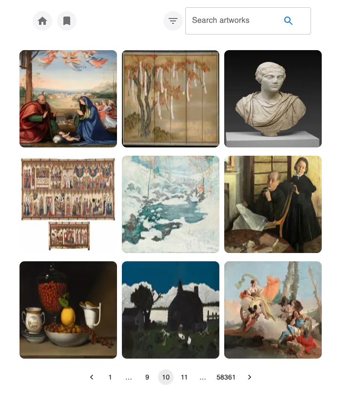

## About 

Pictionary is an art-gallery web app that connectes to the [Art Institute of Chicage API](https://api.artic.edu/docs/#introduction) to fetch and display images at random.




## Getting Started

First, run the development server:

```bash
npm run dev
# or
yarn dev
# or
pnpm dev
# or
bun dev
```

Open [http://localhost:3000](http://localhost:3000) with your browser to see the result.